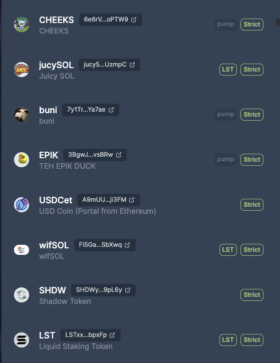

# Display tags for your protocol's tokens

We can ingest your list of tokens and get them tagged automatically, to help your users to trade the right tokens. For example, we have "LST", "pump".fun tokens, and "Strict" list tokens. 

We need:
- A url endpoint (e.g. https://raw.githubusercontent.com/jup-ag/token-list/main/examples/sample_tags.csv)
- That points to a simple [.csv file with a mint address per row](./sample_tags.csv) -- click on link to see sample.
- That we can poll at a set interval (tell us how often you expect updates to happen)

The endpoint should be public, with our IP whitelisted for rate limits where necessary. 

Tell us if you have a preferred word or acronym for your tag, hopefully short and mobile friendly.

That's it!

Example of tags displayed to the right of the token:

